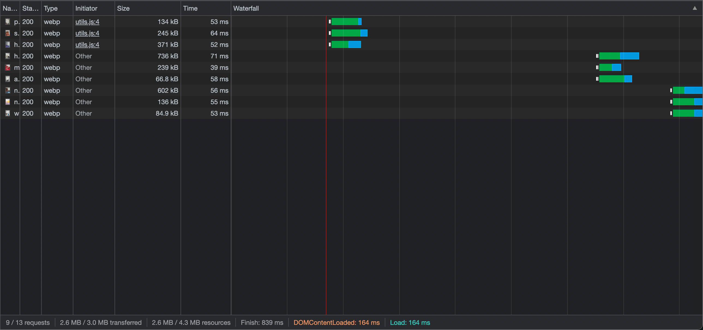

# Preload Images Minimal

## Info

Image preloader. Pass an array of images and preload them either concurrently, sequentially or in batches.

Includes a React hook implementation.

## Setup

```
npm i preload-images-minimal
```

See examples.

## Mode

Concurrent:


Sequential:


Batch (9 images, batchSize = 3):



## Cache-Control

['Guide for Caching and HTTP Cache Headers for Static Content'](https://imagekit.io/blog/ultimate-guide-to-http-caching-for-static-assets/) MANU CHAUDHARY  