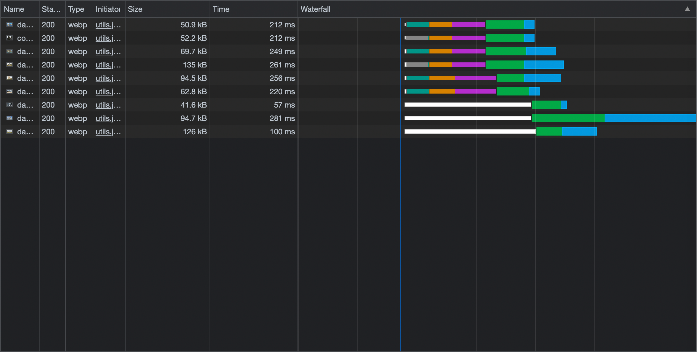
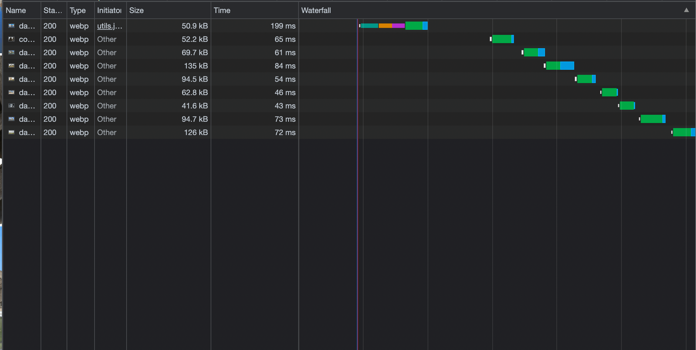

# Preload Images Minimal

## Info

Image preloader. Pass a batch of images and preload them either concurrently or sequentially.

Includes a React hook implementation.

## Setup

```
npm i preload-images-minimal
```

See examples.

## Cache-Control

['Guide for Caching and HTTP Cache Headers for Static Content', MANU CHAUDHARY ](https://imagekit.io/blog/ultimate-guide-to-http-caching-for-static-assets/)

## Concurrent vs Sequential

Concurrent:



Sequential:

