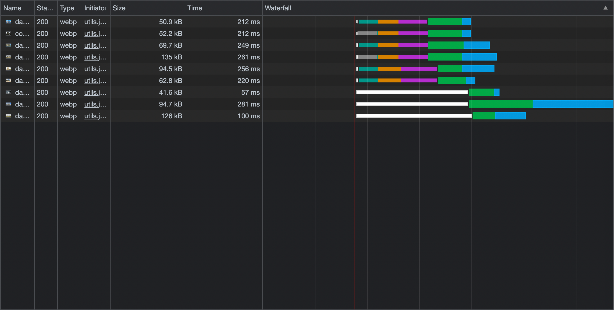
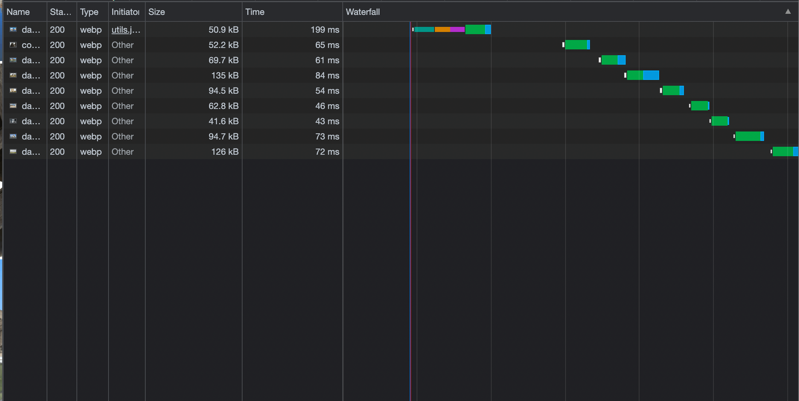

# Preload Images Minimal

## Info

Image preloader. Pass an array of images and preload them either concurrently, sequentially or in batches (the images in each batch are loaded concurrently, the batches are loaded sequentially).

Includes a React hook implementation.

## Setup

```
npm i preload-images-minimal
```

See examples.

## Cache-Control

['Guide for Caching and HTTP Cache Headers for Static Content'](https://imagekit.io/blog/ultimate-guide-to-http-caching-for-static-assets/) MANU CHAUDHARY  

## Concurrent vs Sequential

Concurrent:



Sequential:

